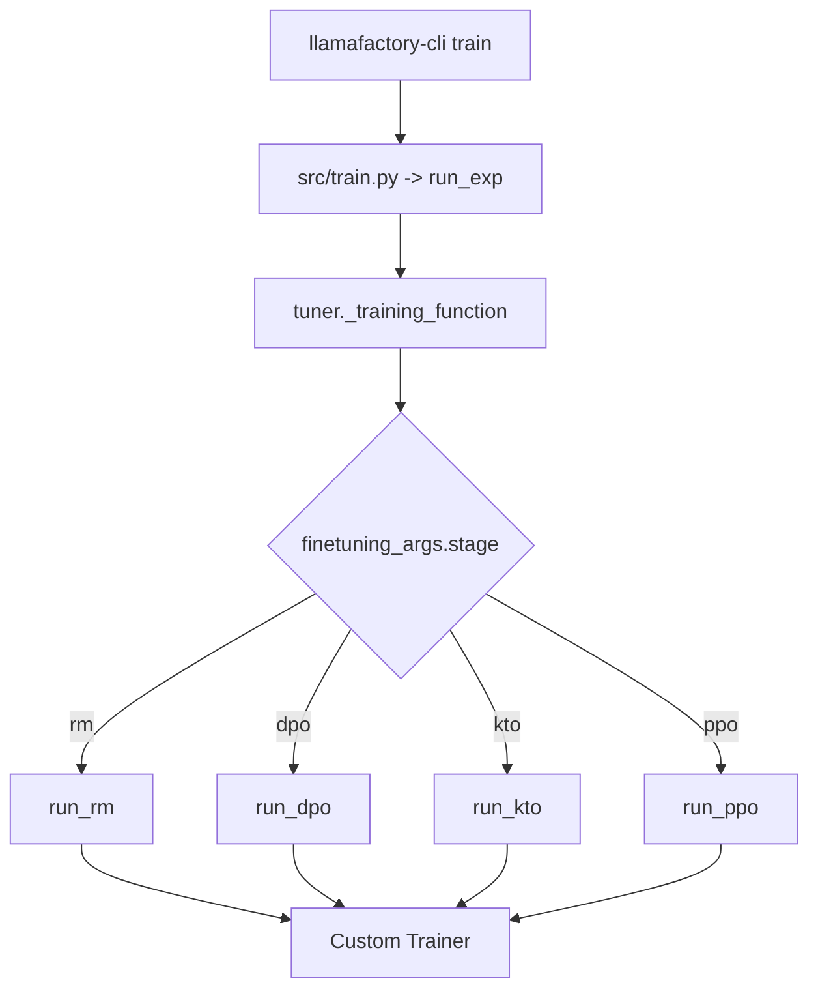

# Codebase Architecture

## High-Level Flow

## Stage Router
- File: `src/llamafactory/train/tuner.py`
- `run_exp()` parses args and dispatches to `_training_function()`.
- `_training_function()` selects stage:
  - `pt`, `sft`, `rm`, `ppo`, `dpo`, `kto`
- For each stage, corresponding `run_*` workflow builds tokenizer, dataset, model, trainer.

## Argument Validation That Matters for RL
- File: `src/llamafactory/hparams/finetuning_args.py`
- Key checks:
  - PPO requires `reward_model`.
  - `use_ref_model` for DPO is auto-decided: true except ORPO/SimPO.
  - `dpo_label_smoothing` only valid with `pref_loss=sigmoid`.
  - Quantization bits for ref/reward model restricted to `4` or `8`.

## Workflow Pattern
Each RL workflow has same skeleton:
1. `load_tokenizer()`
2. `get_template_and_fix_tokenizer()`
3. `get_dataset(..., stage=...)`
4. `load_model()`
5. Build stage-specific data collator
6. Build ref/reward model when needed
7. Instantiate custom trainer
8. Train/eval/save/model-card

## Why This Design Is Useful
- Clear separation of concerns:
  - `hparams`: constraints and defaults
  - `data`: parsing/conversion/tokenization/collation
  - `train/*`: algorithm-specific logic
- Easy for new contributors to add a new preference objective by:
  - extending `finetuning_args`
  - adding trainer loss branch
  - wiring workflow stage if needed
