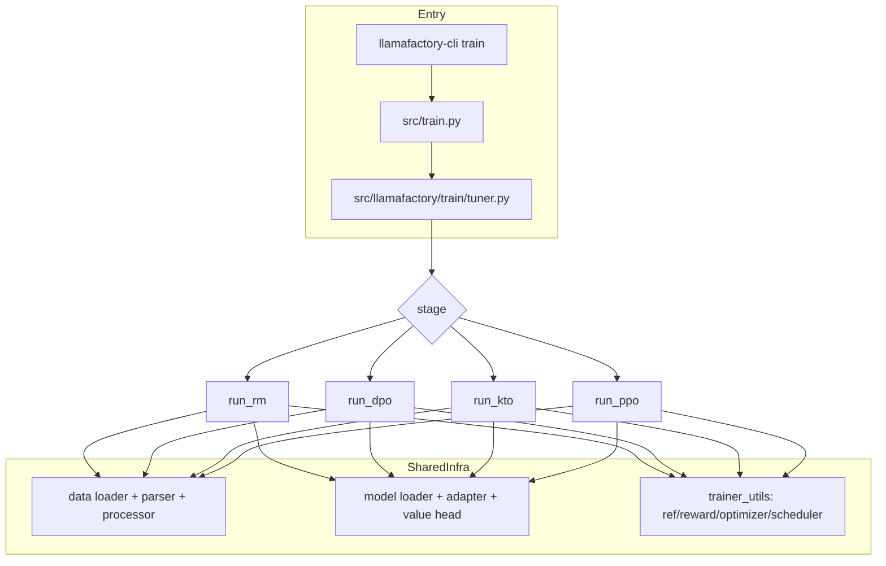
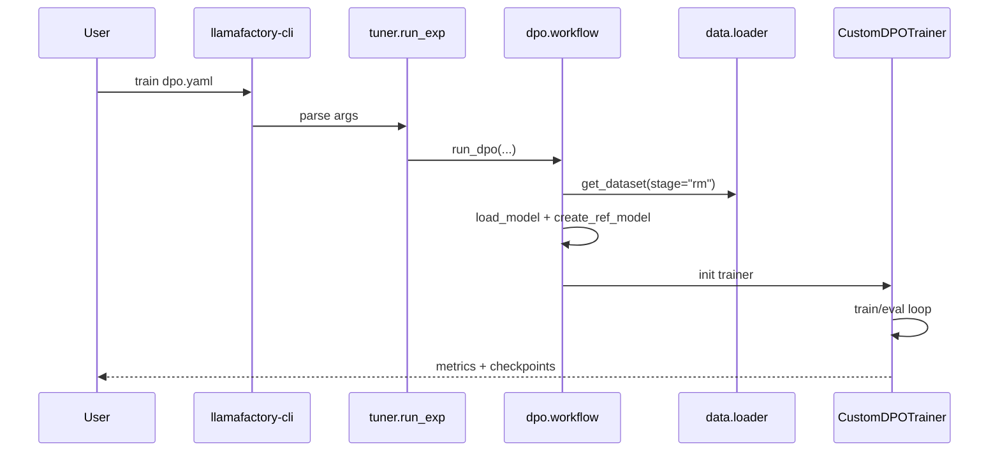

# Kiến trúc mã nguồn LLaMA-Factory và so sánh với HuggingFace TRL

## 1) Toàn cảnh kiến trúc

Điểm chính:
- LLaMA-Factory dùng TRL như một dependency cho một số trainer (PPO/DPO/KTO), nhưng có thêm lớp orchestration và custom behavior quanh data/model/training.
- Có khả năng multimodal, nhiều backend, nhiều optimizer ngoài chuẩn HF.

## 2) Code path cụ thể
- Entry CLI: `src/train.py`
- Router: `src/llamafactory/train/tuner.py`
- Stage workflow:
  - RM: `src/llamafactory/train/rm/workflow.py`
  - DPO: `src/llamafactory/train/dpo/workflow.py`
  - KTO: `src/llamafactory/train/kto/workflow.py`
  - PPO: `src/llamafactory/train/ppo/workflow.py`

## 3) LLaMA-Factory khác TRL ở đâu?

### 3.1 Mức orchestration
- TRL: tập trung trainer + objective.
- LLaMA-Factory: thêm full pipeline:
  - dataset abstraction + parser/converter
  - template/chat-format
  - model loading with LoRA/OFT/freeze/full
  - distributed/ray/webui integration

### 3.2 Dữ liệu và collator
- TRL thường giả định input schema gần chuẩn trainer.
- LLaMA-Factory có processor riêng theo stage:
  - pairwise, feedback(KTO), unsupervised(PPO)
- Hỗ trợ multimodal token mapping + cross attention mask.

### 3.3 Objective extensions
- DPO trainer của LLaMA-Factory mở rộng:
  - ORPO, SimPO, BCO mixing, FTX mixing, LD-DPO alpha.

### 3.4 Reward model handling trong PPO
- Hỗ trợ `reward_model_type`:
  - `full`
  - `lora/oft` (switch adapter + swap value head buffer)
  - `api` (server scoring)

### 3.5 Khả năng sản xuất (production-ish)
- WebUI + CLI thống nhất.
- Nhiều optimizer tích hợp: GaLore/APOLLO/BAdam/Adam-mini/Muon.
- Tương thích đa phần model zoo lớn.

## 4) Minh hoạ sequence chạy `stage=dpo`

## 5) Kết luận kiến trúc
- LLaMA-Factory = “training system” hoàn chỉnh hơn TRL ở tầng workflow.
- TRL vẫn là thành phần quan trọng ở tầng algorithm trainer.
- Nếu mục tiêu là vận hành nhiều bài toán thực nghiệm nhanh, LLaMA-Factory phù hợp hơn việc tự ghép rời rạc TRL + HF scripts.
