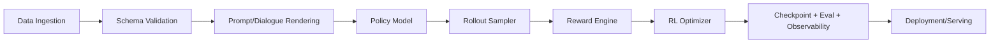

# Một framework RL training cho LLM cần kiến trúc như thế nào?

Tài liệu này mô tả kiến trúc tham chiếu ở mức framework, rồi ánh xạ về LLaMA-Factory.

## 1) Các khối bắt buộc

### Khối 1: Data Layer
- Chuẩn hoá schema (single-turn, multi-turn, tool-calling traces).
- Versioning dataset.
- Filter chất lượng.

### Khối 2: Rendering Layer
- Từ structured messages -> tokenized model input.
- Template phải ổn định giữa training và inference.

### Khối 3: Rollout Layer
- Sinh response online (PPO/GRPO-style).
- Quản lý sampling strategy, max length, stop criteria.

### Khối 4: Reward Layer
- Rule-based + learned reward model + verifier kết hợp.
- Cần log decomposition từng thành phần reward để debug.

### Khối 5: Optimization Layer
- Objective modules (PPO, DPO, KTO, ORPO, ...).
- KL/reference handling.
- Mixed precision, distributed, gradient accumulation.

### Khối 6: Observability Layer
- Loss/reward/KL curves.
- Offline eval + online canary.
- Reproducibility: seed, config snapshot, artifact registry.

## 2) Nguyên tắc kiến trúc
1. Tách objective và data processing.
2. Tách reward model và policy model lifecycle.
3. Một nguồn sự thật cho config và validation.
4. Không để hidden coupling giữa template và dataset.
5. Luôn có fallback path cho inference sanity check.

## 3) Mapping sang LLaMA-Factory
- Data Layer: `src/llamafactory/data/*`
- Rendering: template + mm plugin
- Reward/Ref loading: `trainer_utils.py`
- Optimization: `train/{ppo,dpo,kto,rm}/trainer.py`
- Observability: logging callbacks + plot + report_to

## 4) Nếu muốn thêm GRPO vào LLaMA-Factory
Cần tối thiểu:
1. `stage=grpo` trong args router.
2. Workflow `train/grpo/workflow.py`.
3. Trainer `train/grpo/trainer.py` với grouped rollouts và group-normalized advantage.
4. Config fields mới cho group size, baseline mode, clipping.
5. Logging metrics riêng (group variance, baseline bias, KL drift).
