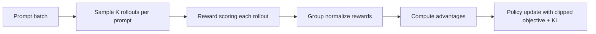

# Ví dụ: GPT-OSS với GRPO cho tool-calling multi-turn

## Trạng thái trong LLaMA-Factory hiện tại
Tại commit phân tích (`f80e15db`), không thấy stage/trainer/workflow GRPO trong source.
Vì vậy, ví dụ dưới đây là **kiến trúc tham chiếu** (reference design), không phải cấu hình chạy trực tiếp bằng `llamafactory-cli train` hiện tại.

## 1) Khi nào dùng GRPO?
- Bài toán cần so sánh nhiều rollout trong cùng một prompt group.
- Muốn giảm variance bằng group-relative baseline.

## 2) Thiết kế run tham chiếu



## 3) Cấu hình tham chiếu (pseudo-YAML)
```yaml
model_name_or_path: openai/gpt-oss-20b
stage: grpo
finetuning_type: lora

dataset: gptoss_toolcall_multiturn_prompts
template: gpt_oss_chat
cutoff_len: 8192

grpo_group_size: 8
grpo_clip_range: 0.2
grpo_kl_coef: 0.02
grpo_adv_norm: group

reward_model: /abs/path/to/toolcall-reward
reward_model_type: full

learning_rate: 1e-6
per_device_train_batch_size: 1
gradient_accumulation_steps: 16
bf16: true
```

## 4) Nếu bắt buộc ở LLaMA-Factory
Bạn cần tự mở rộng source:
1. Thêm `stage=grpo` ở args/router.
2. Viết `train/grpo/workflow.py`.
3. Viết `train/grpo/trainer.py`.
4. Thêm collator/processor phù hợp grouped rollout.
5. Bổ sung UI/CLI parameter mapping.

## 5) Thực tế triển khai
Có thể chạy GRPO nhanh hơn bằng framework khác chuyên online RL rollout (ví dụ verl/vllm stack), sau đó import checkpoint quay lại pipeline inference của bạn.
