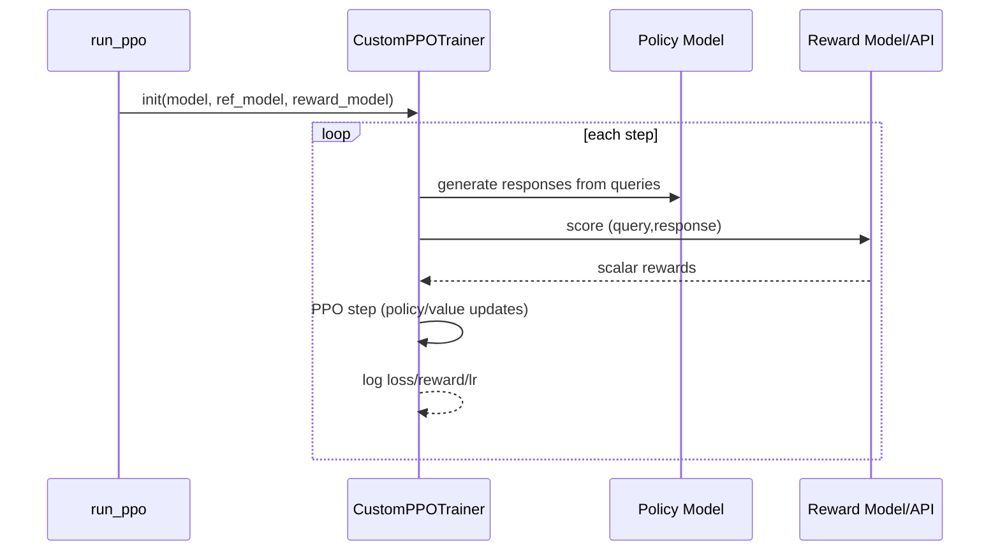

# Phân tích chi tiết PPO từ mã nguồn hiện tại

Mục tiêu: giải thích cho người có nền Mathematics/CV/NLP cùng hiểu.

## 1) PPO trong LLaMA-Factory nằm ở đâu?
- Workflow: `src/llamafactory/train/ppo/workflow.py`
- Trainer: `src/llamafactory/train/ppo/trainer.py`
- Utils reward/adapter swap: `src/llamafactory/train/ppo/ppo_utils.py`

## 2) Quy trình thực thi

## 3) Công thức trực giác
PPO tối ưu objective dạng clipped surrogate:
- `L_clip = E[min(r_t * A_t, clip(r_t, 1-eps, 1+eps)*A_t)]`
- `r_t = pi_theta(a_t|s_t) / pi_theta_old(a_t|s_t)`

Trong RLHF/PPO cho LLM:
- `s_t` ~ token context
- `a_t` ~ token generated
- reward đến từ reward model ở cuối trajectory
- thêm KL control với reference policy để tránh drift quá xa.

## 4) Mapping công thức -> code
- Sinh rollout:
  - `get_inputs()` trong trainer
- Chấm reward:
  - `get_rewards()`
  - hỗ trợ `reward_model_type=api|lora|full`
- PPO update:
  - dùng `trl.PPOTrainer.step(...)` trong loop `ppo_train()`
- Logging:
  - `loss_meter`, `reward_meter` và stats từ TRL

## 5) Tại sao cần value head?
- Value head ước lượng expected return để tính advantage ổn định hơn.
- Trong RM/PPO, value head rất quan trọng; source có callback fix/sync checkpoint value head.

## 6) Các điểm kỹ thuật đáng chú ý trong source
1. Check version TRL chặt: `trl>=0.8.6,<=0.9.6`.
2. PPO loop custom thay vì gọi thẳng trainer HF loop.
3. Với reward adapter (`lora/oft`), code swap adapter + reward/default head buffers.
4. Có đường API reward server cho distributed/scalable scoring.

## 7) Gợi ý tuning thực dụng
1. Bắt đầu `learning_rate` thấp (`1e-6`~`5e-6`).
2. `ppo_epochs` nhỏ trước (2-4).
3. Theo dõi KL drift và reward hacking.
4. Dùng eval hard-cases để chặn overfitting reward.

## 8) Sai lầm thường gặp
- Reward model không cùng tokenizer/vocab với policy.
- Prompt render khác giữa train/eval.
- Reward chỉ tối ưu format, không tối ưu correctness tool call.
