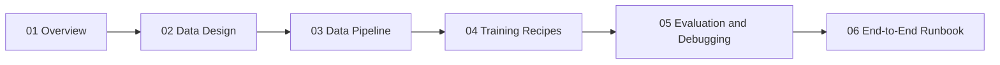

# Series: Train Agent cho Tool-Calling Multi-Turn với LLaMA-Factory

## Series map

## Bạn sẽ học được gì
- Cách định nghĩa hành vi Agent đúng cho bài toán tool-calling multi-turn.
- Cách tạo dữ liệu chất lượng cao để model học đúng hành vi gọi tool.
- Cách chọn thuật toán và set config trong LLaMA-Factory.
- Cách đánh giá thực sự theo task success, không chỉ theo loss/reward.

## Prerequisites
- Nắm cơ bản transformer fine-tuning.
- Biết JSONL, prompt template, LoRA.
- Có môi trường GPU và chạy được `llamafactory-cli train`.

## Phạm vi thuật toán trong source hiện tại
- Có: RM, DPO (kèm ORPO/SimPO), KTO, PPO.
- Chưa thấy stage train riêng: GRPO.

## Đường đi khuyến nghị
1. Đọc `02-data-design-multiturn-toolcalling.md`.
2. Đọc `03-data-build-pipeline-llamafactory.md`.
3. Chạy recipe nhỏ trong `04-training-recipes-rl.md`.
4. Dùng `05-evaluation-and-debugging.md` để khóa chất lượng.
5. Chốt vận hành theo `06-end-to-end-runbook.md`.
