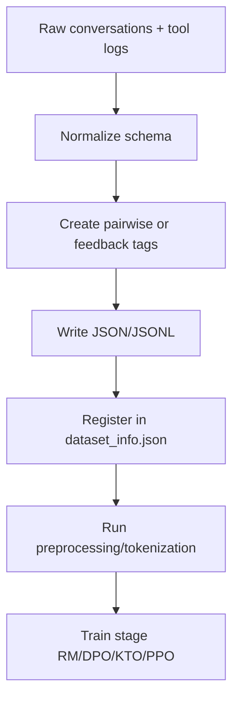

# Pipeline build dữ liệu vào LLaMA-Factory

## 1) Mapping dữ liệu vào framework
Trong LLaMA-Factory:
- `stage=rm` dùng `PairwiseDatasetProcessor`
- `stage=dpo` cũng dùng pairwise path
- `stage=kto` dùng `FeedbackDatasetProcessor`
- `stage=ppo` dùng `UnsupervisedDatasetProcessor`

## 2) Các bước pipeline

## 3) Khuyến nghị file organization
- `data/toolcall/raw/`
- `data/toolcall/processed/`
- `data/toolcall/pairwise/`
- `data/toolcall/kto/`
- `data/toolcall/prompts_for_ppo/`

## 4) Kiểm tra trước khi train
1. In 20 mẫu random sau preprocess.
2. Verify prompt turn count luôn hợp lệ.
3. Verify chosen/rejected khác nhau thực chất.
4. Verify JSON args parse được theo schema tool.

## 5) Template và tokenizer
- Chọn `template` đúng model family (qwen/gemma/gpt_oss...).
- Đảm bảo cùng tokenizer giữa policy-ref-reward nếu có.
- Với context dài multi-turn, tăng `cutoff_len` phù hợp VRAM.

## 6) Mẫu checklist integration
- Dataset đã đăng ký trong `dataset_info.json`.
- Cột mapping đúng (`chosen`, `rejected`, `kto_tag`, ...).
- Không có mẫu rỗng hoặc role sai.
- Tốc độ dataloader ổn (workers + preprocessing workers).
