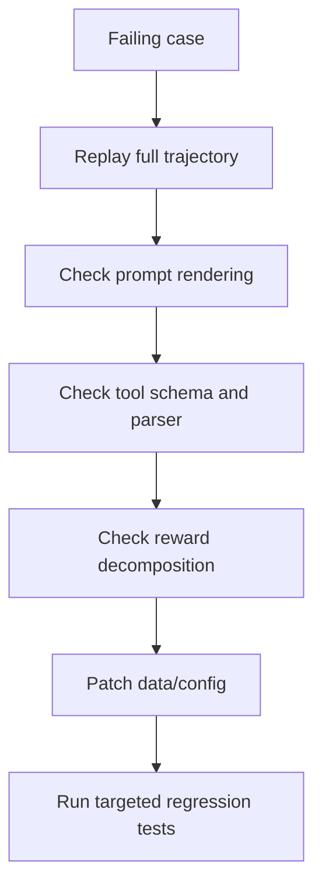

# Evaluation và Debugging cho Agent Tool-Calling

## 1) Đánh giá đúng trọng tâm
Không chỉ nhìn train loss. Cần cả:
- offline task benchmark,
- simulation với tool stubs,
- kiểm tra độ bền trên long multi-turn contexts.

## 2) Bộ test nên có
- Easy factual queries.
- Ambiguous tool-choice queries.
- Missing-info then recovery queries.
- Conflicting observations across turns.

## 3) Error taxonomy
1. Tool selection error.
2. Argument schema error.
3. State tracking error (quên context cũ).
4. Premature conclusion.
5. Over-calling tools.

## 4) Debug workflow

## 5) Guardrails nên có
- JSON schema validation cho tool args.
- Max tool-call turns.
- Tool cooldown hoặc stop criteria.
- Refusal policy khi thiếu dữ liệu bắt buộc.

## 6) Regression protocol
Sau mỗi training run:
1. Chạy fixed benchmark set.
2. So sánh với previous best checkpoint.
3. Chỉ promote khi vượt ngưỡng tất cả KPI cốt lõi.
